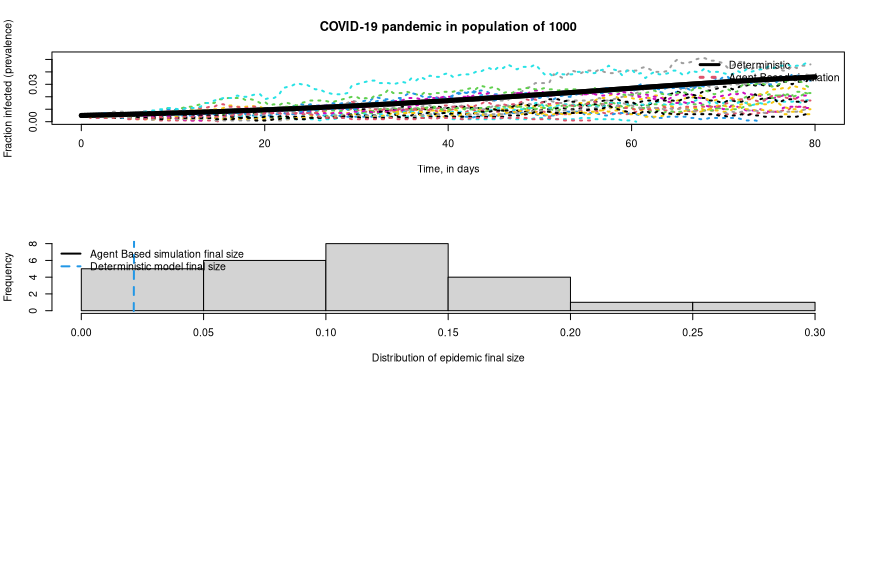

# Agent Based Model Testing
The point of this repo is to have a place to test out ABM in R. 

The journey begins with the article and code written by Sherry Towers which can be found [Here](http://sherrytowers.com/2012/12/12/neiu-lecture-v-stochastic-epidemic-modelling-with-agent-based-models/). All of the original scripts written by Sherry Towers can be found at that link, for the most part this repo will contain those scripts with my modifications and changes.

I have adapted the original script to the reproduction and recovery rates of COVID-19 and added
the Exposed state to the agent based model parameters.

Variables to modify and play with begin on line __51__ of the __sir_agent.R__ script.

To run the SEIR (Susceptible, Exposed, Infected, Recovered) agent based model run the command:
```
source("scripts/sir_agent.R")
```

## Tasks
- [x] Get the Sherry Towers script to run locally
- [x] Change the inputs/equations of the script to explore outputs
  - [x] Change inputs to match COVID-19 reproduction and recovery rates
- [x] Add Exposed class to the script to make it an SEIR model (Susceptible, Exposed, Infected, Recovered)
- [ ] Modify the __agent_grid.R__ script to include Exposed state
- [ ] Long term, add Asymptomatic and Quarantined classes (SEIR + AQ Model)

## Sample Output


